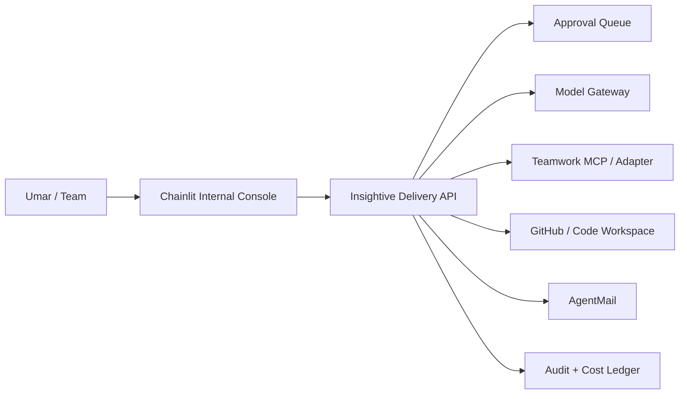

# Chainlit Interface For Insightive Delivery Engine

**Status:** Proposed  
**Date:** 2026-07-05  
**Purpose:** Define how Chainlit can serve as the internal team interface for the hosted Insightive delivery engine.

## Recommendation

Use Chainlit as the first **internal operator console** for Insightive's delivery engine.

Do not make Chainlit the system of record. The system of record should remain the hosted delivery backend plus Teamwork, GitHub, AgentMail, storage, audit logs, and cost ledger.

Chainlit should be the team-facing conversational surface where Umar and team members can:

- Submit work requests.
- Upload files and context.
- Ask the delivery engine for project status.
- Trigger triage, planning, QA, and status-draft workflows.
- Review approval requests.
- See multi-step agent reasoning and tool activity.
- Route work to Teamwork, GitHub, AgentMail, local models, or paid models through the backend.

## Why Chainlit Fits

Chainlit is strong for the first internal interface because:

- It is Python-native and fast to prototype.
- It supports authentication, including OAuth-style setups.
- It supports data persistence through data layers.
- It can show multi-step agent/tool execution.
- It supports MCP connections, including remote services and stdio tools.
- It supports user interaction patterns useful for approvals and clarifying questions.
- It can be customized enough for an internal Insightive-branded console.

## Proposed Role In Architecture

Chainlit should call the Delivery API rather than directly owning all workflow logic. This keeps the system portable if we later build a custom Next.js/React dashboard.

## Good First Use Cases

| Use case | Chainlit fit |
|---|---|
| Intake triage | Strong |
| Clarifying questions | Strong |
| Approval prompts | Strong |
| Agent run visibility | Strong |
| Internal status queries | Strong |
| File/context upload | Strong |
| Tool/MCP testing | Strong |
| Client-facing portal | Possible later, not first |
| Complex dashboards | Better handled by custom UI later |
| Long-term system of record | No |

## MVP Screens / Modes

Use Chainlit chat profiles or starter prompts for these modes:

1. **New Request Intake**
   - Capture client, project, request type, urgency, files, links, and expected outcome.
   - Run Product Analyst triage.
   - Draft Teamwork tasks only after approval.

2. **Project Command Center**
   - Ask for project status.
   - Summarize blockers.
   - Show pending approvals.
   - Draft weekly updates.

3. **Approval Inbox**
   - Show pending actions.
   - Approve, reject, or ask for revision.
   - Record approval decision in audit log.

4. **Agent Run Inspector**
   - Show steps, tools used, model route, cost estimate, and artifacts.
   - Useful for trust-building while automation is still young.

5. **Client Communication Drafting**
   - Draft AgentMail messages.
   - Require Umar approval before send in Phase 1.

## Security Rules

- Require authentication from day one.
- Do not expose raw MCP stdio command access to normal users.
- If MCP stdio is enabled, use an executable allowlist and only trusted commands.
- Never let Chainlit store production secrets in chat.
- Store approvals and audit logs in the backend database, not only Chainlit chat history.
- External messages, production deployments, scope changes, and budget changes must go through the Approval Queue.

## Implementation Slice

Phase 1 Chainlit app:

- Authenticated internal app.
- Connect to Delivery API.
- User/session identity passed to backend.
- Intake mode.
- Approval mode.
- Project status mode.
- Basic persistent chat history.
- Teamwork MCP access through backend-controlled service account.
- Model Gateway access through backend, not direct user-controlled provider keys.

Phase 2:

- Role-based access.
- File evidence viewer.
- Cost dashboard.
- Agent run timeline.
- Teamwork task previews.
- AgentMail draft/approve/send flow.

Phase 3:

- Custom client portal or embedded dashboard if Chainlit becomes limiting.

## Decision

Adopt Chainlit as the **first internal interface** for Insightive delivery operations.

Keep the delivery engine backend independent so Chainlit can be replaced or supplemented by a custom dashboard later.
