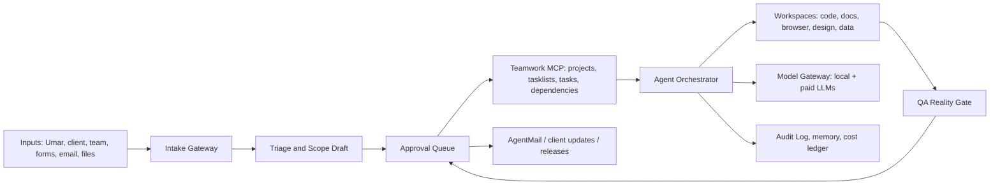

# Insightive Delivery Engine

**Status:** Draft v0.1  
**Owner:** Umar / Insightive  
**Purpose:** Turn this broad agent catalog into a minimum viable delivery team for software, website, automation, and marketing projects.

## Direction

Insightive should not run this repo as a giant collection of autonomous agents. The first useful version is a governed delivery engine:

1. Intake work from Umar, clients, and team members.
2. Convert fuzzy inputs into project records, decisions, tasks, dependencies, and acceptance criteria.
3. Route work to the minimum agent team needed for that project.
4. Use low-cost/local models for routine work and paid frontier models for high-risk reasoning.
5. Require Umar approval for external communication, scope changes, client-visible plans, payments, and production releases.
6. Gradually automate more after repeated successful evidence-backed runs.

Teamwork MCP is the first proven PM surface. It can create projects, tasklists, tasks, milestones, comments, and dependency chains through predecessors. The hosted delivery engine should treat Teamwork as the operational schedule and task graph unless a client requires a different external view.

## Minimum Delivery Team

These are the always-available roles. Each role maps to one or more source agents in this repo, but the hosted engine should expose them as Insightive roles with stricter operating rules.

| Insightive role | Source agent seed | Primary responsibility | Default model tier |
|---|---|---|---|
| Delivery Producer | `project-management/project-management-studio-producer.md`, `project-management/project-manager-senior.md` | Own project flow, Teamwork plan, dependencies, approvals, blockers, weekly/client status | Paid small or local for routine updates, paid frontier for recovery planning |
| Product Analyst | `product/product-manager.md` | Turn intake into problem statement, scope, non-goals, acceptance criteria, and launch success metrics | Paid small/local for extraction, paid frontier for ambiguous discovery |
| Solution Architect | `engineering/engineering-software-architect.md` | Decide technical approach, boundaries, risk, integration plan, and ADRs | Paid frontier by default |
| Implementation Lead | `engineering/engineering-senior-developer.md`, then specialist agents as needed | Convert tasks into code/build steps, coordinate frontend/backend/automation work | Local coding model for drafts, paid frontier for complex changes |
| QA Reality Gate | `testing/testing-reality-checker.md`, `testing/testing-api-tester.md`, `testing/testing-accessibility-auditor.md` | Verify claims with evidence before work is approved, shipped, or shown to client | Local for checklist extraction, paid frontier/vision for evidence review |
| DevOps Release Lead | `engineering/engineering-devops-automator.md`, `engineering/engineering-sre.md` | Environments, deployments, backups, monitoring, release checklist, rollback | Paid small/local for routine ops, paid frontier for incidents |
| Client Comms Agent | `sales/sales-account-strategist.md`, `support/support-support-responder.md`, `marketing/marketing-pr-communications-manager.md` | Draft client updates, questions, meeting summaries, external emails through AgentMail | Paid small for drafting, Umar approval required |
| Model & Cost Controller | `engineering/engineering-prompt-engineer.md`, `engineering/engineering-autonomous-optimization-architect.md` | Route tasks to local vs paid models, track spend, prevent unnecessary context/tool calls | Local model first, paid only when policy allows |

## Specialist Bench

Specialists are not permanent team members. The Delivery Producer calls them only when the project type needs them.

| Project type | Pull these specialists |
|---|---|
| Website / landing page | `design/design-ux-architect.md`, `design/design-ui-designer.md`, `engineering/engineering-frontend-developer.md`, `marketing/marketing-seo-specialist.md` |
| Astro website / content site | `engineering/engineering-astro-web-developer.md`, `design/design-ui-designer.md`, `marketing/marketing-seo-specialist.md`, `marketing/marketing-ai-citation-strategist.md` |
| Shopify storefront | `engineering/engineering-shopify-website-developer.md`, `design/design-ui-designer.md`, `marketing/marketing-seo-specialist.md`, `paid-media/paid-media-tracking-specialist.md` |
| Shopify app | `engineering/engineering-shopify-app-developer.md`, `engineering/engineering-backend-architect.md`, `security/security-appsec-engineer.md`, `testing/testing-api-tester.md` |
| SaaS / web app | `engineering/engineering-backend-architect.md`, `engineering/engineering-frontend-developer.md`, `engineering/engineering-database-optimizer.md`, `testing/testing-api-tester.md` |
| Automation / integrations | `engineering/engineering-ai-engineer.md`, `engineering/engineering-email-intelligence-engineer.md`, `engineering/engineering-devops-automator.md` |
| AI/data project | `engineering/engineering-ai-engineer.md`, `engineering/engineering-data-engineer.md`, `engineering/engineering-ai-data-remediation-engineer.md` |
| Marketing project | `marketing/marketing-content-creator.md`, `marketing/marketing-email-strategist.md`, `marketing/marketing-linkedin-content-creator.md`, `paid-media/paid-media-tracking-specialist.md` |
| Security-sensitive project | `security/security-architect.md`, `security/security-appsec-engineer.md`, `support/support-legal-compliance-checker.md` |

## Hosted Engine Shape

## Core Components

| Component | Job |
|---|---|
| Intake Gateway | Receives client/team/Umar inputs from forms, AgentMail, Teamwork comments, uploaded docs, and eventually chat channels. |
| Normalizer | Converts messy inputs into structured records: client, project, request, decision, risk, task, artifact, approval. |
| Teamwork PM Adapter | Creates and updates project/task graph, dependencies, status comments, milestones, and client-facing plan items. |
| Agent Orchestrator | Runs the minimum role sequence for a request, assigns tools, enforces approval policy, and writes evidence. |
| Model Gateway | Routes prompts to local or paid models by risk, context size, and required capability. |
| Workspace Runner | Executes coding, browser, document, spreadsheet, and deployment work in isolated project workspaces. |
| Approval Queue | Holds actions requiring Umar approval: scope changes, client messages, purchases, production deploys, destructive edits. |
| AgentMail Adapter | Sends formal external communication only after approval in early phases. |
| Audit and Memory Store | Records who/what acted, model used, input/output, cost, files touched, decisions, and evidence. |

## Model Routing Policy

Use local models aggressively for low-risk and repetitive work, but do not let cost savings damage delivery quality.

| Work type | Default route | Escalate when |
|---|---|---|
| Classification, tagging, summarizing, duplicate detection | Local small model | Client-facing summary or legal/financial/security implication |
| Task drafting, acceptance criteria, status update drafts | Local or paid small model | Ambiguous scope, conflict, unhappy client, contractual commitment |
| Code search, simple edits, test log triage | Local coding model | Multi-file architecture change, failing production, security-sensitive |
| Architecture, estimates, risk decisions, conflict resolution | Paid frontier model | Always, until enough internal eval data exists |
| External email/message drafting | Paid small/frontier depending sensitivity | Always require approval before sending in Phase 1 |
| QA evidence review | Local for checklist, paid frontier/vision for final judgment | Client-visible or release approval |

Initial local model candidates:

- `qwen3:8b` or `qwen3:14b` for general routing, summarization, and agent planning.
- `qwen2.5-coder` or newer Qwen coder models for low-risk code drafts and code explanation.
- `gemma3:4b` or `gemma3:12b` for fast summarization and multimodal/vision-adjacent review where quality is sufficient.
- Larger local models only if hosted GPU economics beat API pricing after measurement.

The hosted engine should record every run with `model`, `provider`, `input_tokens`, `output_tokens`, `tool_calls`, `estimated_cost`, `actual_cost`, `approved_by`, and `outcome`.

## Approval Ladder

| Phase | Human approval requirement |
|---|---|
| Phase 1: Assisted | Umar approves all external messages, new project plans, task graph changes above minor cleanup, deployments, purchases, and scope changes. |
| Phase 2: Guarded autonomy | Agents can update internal Teamwork tasks, draft docs, run tests, and prepare PRs. Umar approves client-visible and production actions. |
| Phase 3: Partial autonomy | Trusted workflows can send low-risk status updates, create routine tasks, and run deployments to staging. Exceptions still require approval. |
| Phase 4: Managed autonomy | Agents operate within budgets and playbooks, with sampled audits and automatic escalation on risk signals. |

## First Build Slice

1. Keep this repo as the role catalog and operating doctrine.
2. Use Teamwork MCP as the project/task/dependency system.
3. Build a hosted Intake + Orchestrator service.
4. Add Model Gateway with local Ollama/vLLM plus paid provider routing.
5. Add Approval Queue before AgentMail and production deploy actions.
6. Start with one real project type: Malco-style software delivery.
7. Measure cost, time saved, QA pass rate, approval rejection rate, and client communication quality.

## Non-Goals For v0

- No fully autonomous client communication.
- No autonomous production deployments.
- No broad “all agents active” swarm.
- No replacing Umar’s final commercial judgment.
- No complex HR-style resource planning until task graph and approval flow are reliable.

## Open Questions

- Which hosted stack should run the engine: Next.js + Postgres + workers, Django/FastAPI + workers, or SMEFoundation later?
- Should Teamwork be both internal and client-facing, or should ClickUp remain internal for selected workflows?
- Which channels are first-class inputs: AgentMail, Teamwork comments, web form, Slack/WhatsApp, uploaded docs?
- What budget ceiling should be enforced per project, per client, and per day?
- Which local GPU/server budget is acceptable for Insightive in Phase 1?
